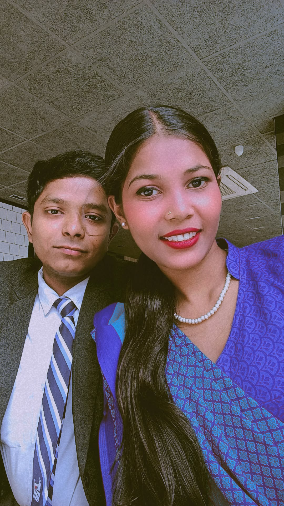

<!DOCTYPE html>
<html lang="en">
<head>
    <meta charset="UTF-8">
    <meta name="viewport" content="width=device-width, initial-scale=1.0, maximum-scale=1.0, user-scalable=no">
    <title>For My Moon 🌙</title>
    
</head>
<body>

    

        <h1 id="mainText">Will you be my Valentine? ❤️</h1>
        
⚠️ CLICK NO! ⚠️

        

            <button id="yesBtn" onclick="handleYes()">YES</button>
            <button id="noBtn" onclick="handleNo()">NO</button>
        

        
10

    

    

        
        
        
        
        
        
        
        
        

            

            
SYSTEM ERROR

        

    

    <canvas id="gameCanvas" style="display:none; position:fixed; top:0; left:0; z-index:200;"></canvas>
    <audio id="bgMusic"https://indirect-magenta-0ln0zr2dt5.edgeone.app/September%204.mp3" loop></audio>

    
</body>
</html>
